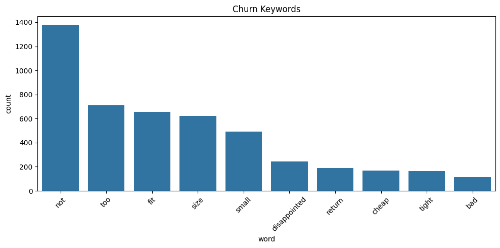

</> Markdown
# 📊 쇼핑몰 리뷰 기반 이탈 사용자 분석 프로젝트 

## 📌 프로젝트 개요
본 프로젝트는 단순 리뷰 분석이 아닌,  
**"고객이 왜 이탈하는가"를 데이터 기반으로 정의하고  
실제 비즈니스 개선 전략(CRM)으로 연결하는 것**을 목표로 합니다.

---

## 📌 문제 정의
이커머스 환경에서 고객 이탈은 다음과 같은 문제를 발생시킵니다:

- 반품 증가 → 물류 비용 상승  
- 재구매 감소 → 매출 감소  
- 고객 신뢰도 하락  

👉 따라서 단순 만족도 분석이 아닌  
**이탈의 "원인"을 구조적으로 파악하는 것이 핵심 문제입니다.**

---

## 📌 데이터 설명

- 데이터 출처: Kaggle - Women's E-Commerce Clothing Reviews
- 데이터 수: 약 23,000건

### 주요 컬럼
- `Rating`: 평점 (1~5)
- `Recommended IND`: 추천 여부
- `Review Text`: 리뷰 텍스트

👉 정형 데이터 + 비정형 텍스트 데이터를 함께 활용

---

## 📌 분석 과정

### 1. 텍스트 전처리
- HTML 제거
- 소문자 변환
- 특수문자 제거
- 공백 정리

---

### 2. 사용자 유형 정의

| 유형 | 조건 |
|------|------|
| Stable | 평점 높음 + 추천 |
| Churn | 평점 낮음 + 비추천 |
| Hidden Churn | 평점 높음 + 비추천 |
| Inconsistent | 평점 낮음 + 추천 |
| Neutral | 기타 |

---

### 3. 키워드 기반 이탈 분석
- 부정 키워드 리스트 정의
- 이탈 사용자 리뷰에서 키워드 빈도 분석

---

## 📊 분석 결과

### 1. 사용자 유형 분포

- Stable: 17,261명  
- Churn: 2,261명  
- Hidden Churn: 187명  

👉 **약 10% 수준의 명확한 이탈 사용자 존재**

---

### 2. Churn 사용자 키워드 분석

- 주요 키워드:
  - not, too, small, fit, size  
  - disappointed, return, cheap  

👉 **전반적인 불만 + 품질 문제 + 사이즈 문제**

---

### 3. Hidden Churn 키워드 분석

- 주요 키워드:
  - not, fit, size, small, too  

👉 **대부분 만족하지만 "핏/사이즈 문제" 존재**

---

## 🔥 핵심 인사이트

### 1. 공통 핵심 문제

다음 키워드가 모든 이탈 유형에서 공통적으로 등장:

- `size`
- `fit`
- `small`

👉 단순 불만이 아니라  
👉 **구조적인 제품 문제 (사이즈/핏)**

---

### 2. 이탈 구조

| 구분 | 특징 |
|------|------|
| Churn | 품질 + 사이즈 + 전반적 불만 |
| Hidden Churn | 사이즈/핏 중심 불편 |

👉 Hidden Churn은  
**"곧 이탈할 가능성이 높은 고객"**

---

### 3. 비즈니스 해석

고객은 제품 자체보다  

👉 **"착용 경험"에서 이탈**

즉,

👉 상품 문제가 아니라  
👉 **정보 전달 + 핏 예측 문제**

---

## 🎯 CRM 전략

### 1. Churn 사용자 (이미 이탈)

#### 전략: 문제 해결형 접근

- 사이즈 보정 정보 제공  
  → "이 상품은 한 사이즈 작게 나왔습니다"

- 품질 정보 강화  
  → 소재 / 두께 / 착용감 명확화

- 반품 고객 리타겟팅  
  → "핏 개선 상품 추천"

---

### 2. Hidden Churn (잠재 이탈)

#### 전략: 사전 차단형 접근

- 개인화 사이즈 추천
- 체형 기반 리뷰 노출
- 구매 전 핏 안내 강화

👉 핵심:
**불만 발생 전에 제거**

---

## 📈 Business Impact

### 기대 효과

- 반품률 감소  
- 구매 전환율 증가  
- 고객 신뢰도 상승  
- 재구매율 증가  

---

## 💡 핵심 결론

본 프로젝트는 단순 리뷰 분석을 넘어  

👉 **이탈의 원인을 데이터 기반으로 구조화하고  
→ 실제 CRM 전략으로 연결했다는 점에서 의미가 있음**

특히,

👉 **사이즈/핏 문제는 핵심 이탈 요인**

---

## 📂 프로젝트 구조

project/
│
├── data/
│ └── Womens Clothing E-Commerce Reviews.csv
│
├── images/
│ ├── churn_keywords.png
│ └── hidden_churn_keywords.png
│
├── notebook/
│ └── churn_analysis.ipynb
│
├── src/ (optional)
│  
│
└── README.md

### 📌 폴더 설명
- **data/** → 원본 데이터 저장
- **images/** → 그래프 결과 저장 (README에서 사용)
- **notebook/** → 실제 분석 코드
- **src/** → 코드 정리용 (선택)

---

## 🚀 확장 가능성

- 개인화 추천 시스템 연동
- CRM 자동화
- 실시간 리뷰 분석 시스템 구축