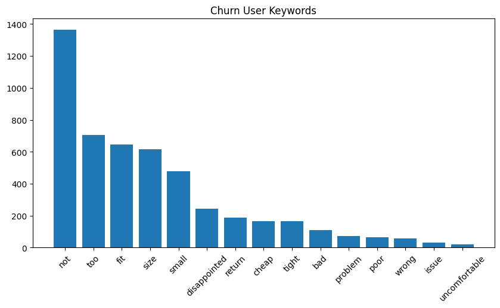
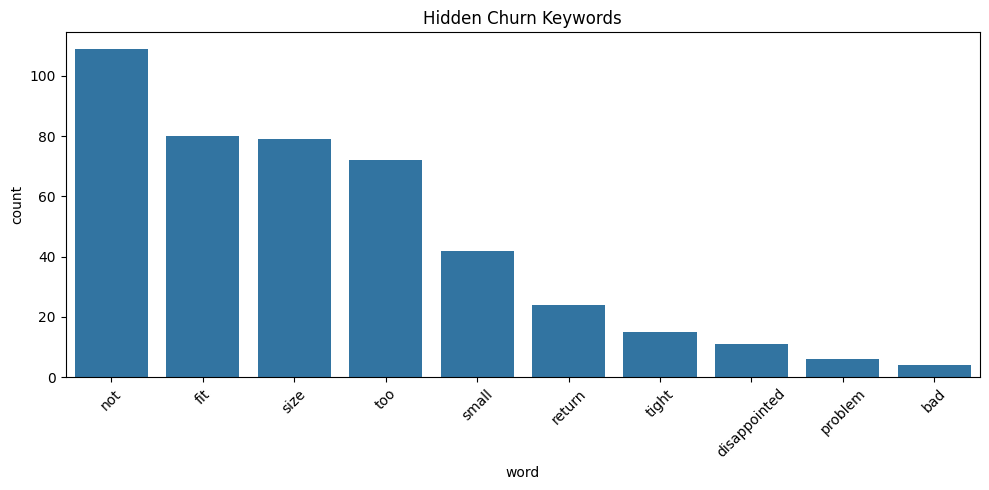

</> Markdown 

# 📊 쇼핑몰 리뷰 기반 이탈 사용자 분석 프로젝트 

## 📌 목차 
1. [프로젝트 소개](#프로젝트-소개)
2. [데이터 설명](#데이터-설명)
3. [분석 과정](#분석-과정)
4. [분석 결과](#분석-결과)
5. [CRM 전략](#crm-전략)
6. [Business Impact / 활용 시나리오](#business-impact/활용-시나리오)

---

## 프로젝트 소개 
쇼핑몰 리뷰 데이터를 기반으로 사용자의 이탈 요인을 분석하고 CRM 전략을 도출하는 프로젝트입니다.

--- 

## 데이터 설명 
※ 해당 데이터는 공개 데이터셋을 활용하여 분석을 진행하였습니다.

- 데이터 출처: [Kaggle - Women's Ecommerce Clothing reviews](https://www.kaggle.com/datasets/nicapotato/womens-ecommerce-clothing-reviews?resource=download)
- 데이터 구성:
    - Age: 사용자의 나이
    - Rating: 상품 평점(1~5)
    - Recommended IND: 추천 여부 (1: 추천, 0: 비추천)
    - Review Text: 리뷰 내용
- 총 데이터 수: 약 23,000건

-> 사용자 리뷰, 평점, 추천 여부를 기반으로 고객 만족도 및 이탈 가능성을 분석

## 분석 과정 
- 텍스트 데이터 전처리 (소문자 변환, 특수문자 제거, 불용어 제거)
- 평점(Rating)과 추천 여부(Recommended IND)를 기준으로 사용자 유형 분류
- Stable / Churn / Hidden Churn / Inconsistent / Neutral
- 이탈 사용자(Churn) 및 잠재 이탈 사용자(Hidden Churn) 정의
- 부정적인 키워드 기반 텍스트 분석 수행
- 키워드 빈도 시각화를 통해 주요 이탈 요인 도출

--- 
## 분석 결과 

### 1. 사용자 유형 분포 
- Stable: 17,261명 - Neutral: 2823명 - Churn: 2261명 - Hidden Churn: 187명 - Inconsistent: 109명

-> 전체 사용자 중 일부는 명확하게 이탈 행동을 보였으며, 잠재적으로 이탈 가능성이 있는 사용자군도 존재함. 

--- 

### 2. 사용자 유형별 특징 비교

| 유형 | 특징 | 해석 |
|------|------|------|
| Stable | 평점 높음 + 추천 | 만족 상태 |
| Churn | 평점 낮음 + 비추천 | 명확한 이탈 |
| Hidden Churn | 평점 높음 + 비추천 | 잠재 이탈 |
| Inconsistent | 평점 낮음 + 추천 | 데이터 혼합 |

---

### 3. 이탈 사용자(churn) 키워드 분석 
 
- 주요 키워드: not, too, small, fit, size, disappointed, return, cheap

-> 전반적인 만족도가 낮으며, 사이즈 및 핏 문제와 함께 품질에 대한 불만이 주요 이탈 요인으로 나타남. 

---

### 3-1. Churn vs Hidden Churn 키워드 비교

| 구분 | 주요 키워드 | 특징 |
|------|------------|------|
| Churn | not, too, small, fit, size, disappointed, return, cheap | 강한 부정 표현 + 품질 및 불만 요소 포함 |
| Hidden Churn | not, fit, size, small, too | 상대적으로 약한 불만 + 주로 사이즈/핏 문제 중심 |

-> Churn 사용자는 품질 및 전반적인 만족도 문제까지 포함된 강한 이탈 신호를 보이며, 
Hidden Churn 사용자는 주로 사이즈 및 착용감 문제에서 발생하는 잠재적 이탈 신호를 보임.

### 4. 잠재적 이탈 사용자(hidden_churn) 키워드 분석 
 
- 주요 키워드: not, fit, size, small, too

-> 전반적인 만족도는 높지만, 사이즈 및 착용감 불편 요소가 반복적으로 나타남.

--- 

### 5. 핵심 인사이트 

- 사이즈(size), 핏(fit), 작음(small) 관련 키워드가 공통적으로 높은 빈도를 보임.
- 이는 사이즈 및 착용감 문제가 주요 이탈 요인임을 의미함.

--- 

### 6. 키워드 기반 리뷰 분석
'size', 'fit', 'small' 키워드가 포함된 리뷰 예시:

- 체형 대비 과도한 사이즈로 인해 착용이 어려운 경우
- "not true to size"와 같이 사이즈 표기와 실제 착용감의 불일치
- 소매, 길이 등 제품 설계 문제로 인해 핏이 어색한 경우
- 소재 품질 저하로 인해 착용감이 떨어지고 만족도가 감소한 경우

-> 실제 리뷰에서는 "사이즈 불일치, 핏 문제, 품질 문제"가 복합적으로 작용하여 
이탈 및 반품으로 이어지는 패턴을 확인할 수 있었음.

### 7. 결론

본 분석을 통해 단순 평점 기반이 아닌, 
리뷰 텍스트 데이터를 활용하여 사용자의 실제 이탈 원인을 구체적으로 도출함.

특히 사이즈 및 핏 문제는 모든 사용자 유형에서 반복적으로 나타나는 핵심 이탈 요인이며,
이를 기반으로 한 데이터 중심의 CRM 전략 설계가 중요함을 확인함.

## CRM 전략 

### 1. 이탈 사용자(churn) 대상

- 사이즈 불일치 문제 해결을 위한 "사이즈 보정 정보" 제공
    - "이 상품은 한 사이즈 작게 나온 제품입니다"와 같은 안내 문구 자동 노출

- 실제 구매자 데이터를 기반으로 한 체형별 리뷰 우선 노출
    - 유사 체형 사용자 리뷰를 상단에 배치하여 구매 신뢰도 확보

- 품질 관련 불만 감소를 위한 상세 소재 정보 및 착용감 정보 강화
    - "얇음 / 두꺼움 / 신축성 / 착용감" 등 구체적 정보 제공

- 반품 경험 사용자 대상으로 리타겟팅 CRM
    - "핏이 개선된 유사 상품 추천"
    - "사이즈 만족도 높은 상품 추천"

-> 단순 혜택 제공이 아닌, 이탈 원인을 직접 해결하는 구조로 접근

-> 리뷰 데이터 기반으로 도출된 주요 이탈 요인을 직접적으로 해결하는 전략 설계

--- 

### 2. 잠재적 이탈 사용자(hidden_churn) 대상 

- 개인화된 사이즈 추천 시스템 도입 및 고도화
    - 사용자 구매 이력 + 리뷰 데이터 기반 사이즈 추천

- "사이즈 및 핏 관련 사전 안내" 강화
    - 구매 전 단계에서 핏 관련 경고 및 가이드 제공

- 체형 기반 상품 추천 기능
    - 키/체형 유사 사용자 만족도가 높은 상품 우선 추천

- CRM 메시지 개인화
    - "고객님과 비슷한 체형의 고객들이 만족한 상품입니다"와 같은 메시지 활용

-> 특정 불편 요소 사전에 제거하여 이탈 방지 

-> 데이터 기반 사전 대응 전략을 통해 잠재적 이탈 예방

---

### 3. 기대 효과

- 사이즈/핏 관련 불만 감소 -> 반품률 감소
- 사용자 신뢰도 상승 -> 재구매율 증가
- 개인화 추천 강화 -> 고객 LTV 증가

---

## Business Impact / 활용 시나리오

본 분석은 단순 이탈 원인 파악을 넘어, 실제 서비스 성과 개선에 직접적으로 활용될 수 있는 구조로 설계했습니다.

리뷰 데이터 약 23,000건을 분석한 결과, 사이즈 및 핏 문제는 단순 불편 요소가 아니라 반품 및 이탈로 이어지는 핵심 요인으로 확인되었습니다. 해당 문제를 해결하지 않을 경우, 고객 이탈 증가와 함께 반품 비용 상승, 재구매율 감소로 이어질 가능성이 높습니다.

반면, 분석을 통해 도출한 전략을 실제 서비스에 적용할 경우 다음과 같은 개선을 기대할 수 있습니다.

- 사이즈 보정 정보 제공 → 구매 정확도 향상 → 반품률 감소  
- 체형 기반 리뷰 및 추천 노출 → 구매 신뢰도 상승 → 전환율 증가  
- 반품 경험 고객 대상 개인화 추천 → 재구매 유도 → 고객 유지율 개선  

특히, 동일한 데이터라도 고객의 비즈니스 구조나 운영 방식에 따라 적용 방식은 달라질 수 있습니다. 따라서 단일 기능 제공이 아닌, 고객 상황에 맞는 방식으로 활용 방안을 설계하는 것이 중요합니다.

이와 같이 데이터 분석 결과를 실제 서비스 운영에 적용 가능한 형태로 정리함으로써, 고객 경험 개선과 비즈니스 성과 개선을 동시에 달성할 수 있는 구조를 만들었습니다.
